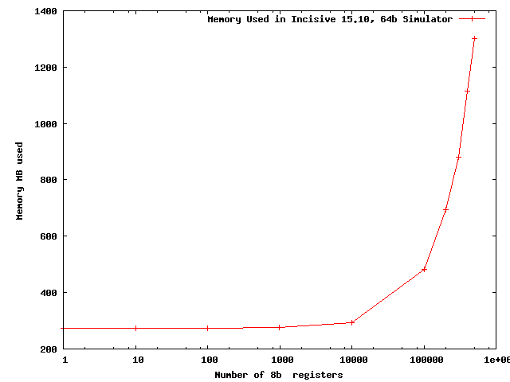
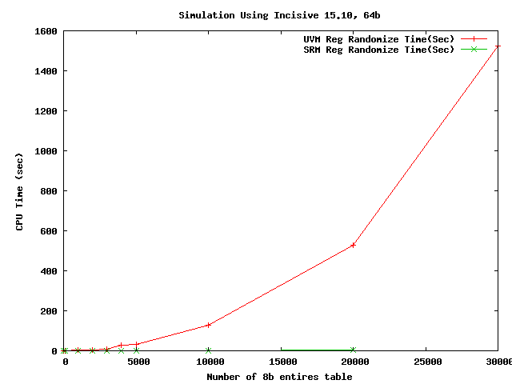

# Introduction 
A register model (or register abstraction layer) is a model of the software visible registers and memories in the design. The model, implemented as system verilog classes, makes the job of stimulus generation, functional checking and functional coverage easier for the test writer. 

Currently the uvm verification methodology ships with the uvm_register package (uvm_reg) that can be used to model these registers and memories in the design. However this framework is heavyweight and does not scale well for large System On Chip (Soc) testbenches. With the current SoC chips having tens of thousand registers and embedded memories, the framework adds a signficant load and build time performance penalty to the testbench. 

Hence a need for developing a open source, clean slate, simple register model(SRM) framework that is light weight and has a much cleaner api for the test writer. The new framework fits seamlessly with both UVM or a legacy non UVM environment. Using SRM, allows the testwriter to write test sequences that are more reusable across different hierarchy of testbenches (like block, sub system, system level) and different access mechanism like frontdoor, backdoor etc. 

## Major Issues With UVM REG

### Static Memory Allocation
The current uvm_reg api causes memory to be allocated for the entire register model independent of the actual locations accessed by the test. It is well known that most tests, especially at system level, only access a small fraction of the address space. Hence is is wasteful to pay for the unused locations for all tests.[Litterick](http://www.verilab.com/files/litterick_register_final_1.pdf).

The graph below shows the memory footprint of a uvm testbench with different number of 8bit registers in uvm_reg model. This testbench is a modified version of the popular example on the web [Cluelogic](http://cluelogic.com/2012/10/uvm-tutorial-for-candy-lovers-register-abstraction/). Source code is available on [GitHub](https://github.com/sanjeevs/uvm_reg_gotchas)

In this benchmark, the test accesses a single location but we increase the number of register instances in the register model. Running on 64 bit Incisive simulator 15.10, we find that the memory footprint of the testbench starts increasing exponentially with 10K registers. By 400K bytes it has increased over 1Gbyte of memory. 

SRM fixes the problem by creating a sparse memory model for register array. None of the entries are allocated till the entry is actually written. Hence the memory usage depends linearly on the number of locations accessed. 

### Randomization of Embedded Memories
uvm_reg views embedded memories (a.k.a tables) as a static array of registers. However this solution does not scale randomization beyond some trivial sizes.

For external memories, uvm_reg does provide a lightweight access api of *uvm_vreg*. This provides only basic read/write access and does not implement any storage or randomization needed by the test writer. Hence unsuitable for writing functional sequences. 

As shown below the time taken by the randomization call on the table is exponential with the size of the table. It is only practical for tables with size less than 15K entries.

SRM fixes the problems of embedded memories by creating a new abstraction *srm_reg_array*. The testwriter can apply the constraints on each entry of the table individually in a loop, allowing reasonable randomization time. 

### Confusing Access API
uvm_reg adds the random constraints and the selection of the access policy (frontdoor/backdoor) as part of the register model access api. For example to support constraint randomization, it adds the *mirror* and *update* routine. For supporting backdoor access, it has the *peek* and *poke* routine. This creates a large monolithic api for unrelated concerns instead of a more modular api.  [AgileSoc](http://agilesoc.com/2014/03/09/youre-either-with-me-or-youre-with-the-uvm-register-package/)

SRM refactors the acess api from the randomization and selection of the access policy. Access api for  register model is intuitively similar to real world software programming. Hence SRM access api provides basic tasks like *read*, *write* api of the software land. 

Constraint randomization is done by a separate hierarchy of constraint classes that are used to generate the data to be written. 

Similarly the access type (frontdoor, backdoor, etc) are encapsulated by their own separate *srm_access_policy* classes. This allows the policy to be actually selected depending on the context the sequence was spawned. For example the same sequence, if run as part of configuration, would use any available backdoor policies. If run, as part of background noise, it would ignore background policy and instead always use frontdoor policy.

## Test bench setup
The testbench setup is similar to uvm_reg. Both active and passive operations are supported. 

### Active Operation
In active operation the register access are sourced by the register model via the access api. These *read* and *write* operations on the register model are converted to generic bus transactions by the model. These are then forwarded to the selected bus adapter as per the configured adapter policy. The selected bus adapter implements the actual conversion from the generic transaction to the actual bus transaction. 

For example the backdoor adapter may just use dpi to directly set/get the design flops. A frontdoor adapter would run the actual bus transaction to implement the transfer.

### Passive Operation
For passive operation the register access is not generated by the register model. This could be generated by some other mechanism like embedded sofware, or a legacy non UVM environment but the model is still required to be accurate for the checks and functional coverage.

In this case a predictor is used to observe the bus transactions and then forward them to the srm register model.

## References
[Cluelogic][http://cluelogic.com/2012/10/uvm-tutorial-for-candy-lovers-register-abstraction/]

[BenchmarkCode][https://github.com/sanjeevs/uvm_reg_gotchas]

[AgileSoc][http://agilesoc.com/2014/03/09/youre-either-with-me-or-youre-with-the-uvm-register-package/]

[Litterick][http://www.verilab.com/files/litterick_register_final_1.pdf]
