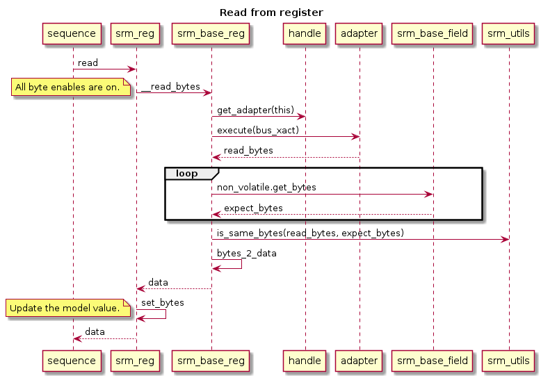
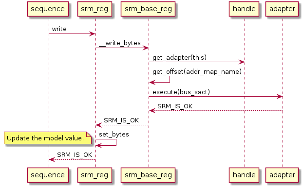
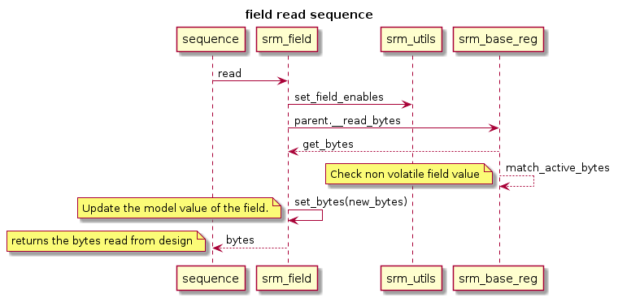
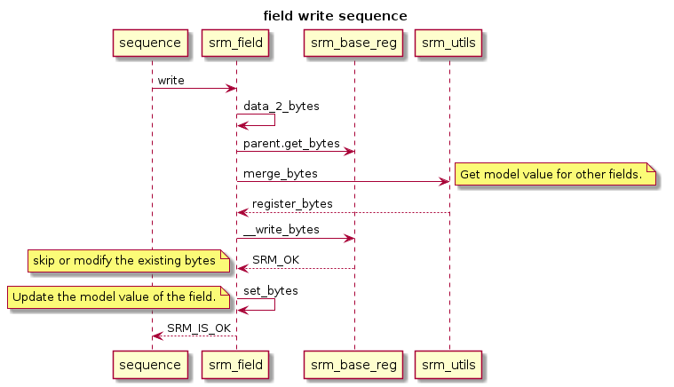
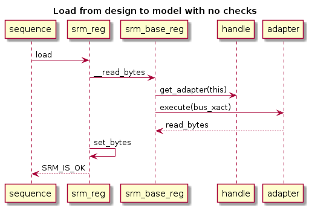

# Design Of SRM
This document walks through the sequence of messages for the important api methods.

## Register Read
The following is the simplified sequence diagram for the register read. 
 1. The read task will call the *__read_bytes* on the base register. 
 2. The base register selects the bus adapter to use from the policy specified in the handle. 
 3. The adapter launches the read operation on the design and returns the data read from the design.
 4. The base register matches the design data for all the non volatile fields with the model values.
 5. The returned bytes are then written into the model and returned to the caller.

## Register Write
The following is the simplified sequence diagram for the register write. 
 1. The write task will call the *_write_bytes* on the base register. 
 2. The base register selects the bus adapter to use from the policy specified in the handle. 
 3. The adapter launches the write operation on the design and writes the data to the design.
 4. The bytes are then written into the model and OK returned to the caller.

## Field Read
This is similar to a register read except that the correct byte enables are computed. Once the data is returned from the design only the active non volatile field values are checked and all the active fields in the model are updated. 

## Field Write
This is similar to the register write except that the correct byte enables are generated and the inactive field values are the values from the model. It is the reponsibility of the bus adapter to handle the byte enables natively or do a read modify write operation. If the fields are non volatile then the adapter can directly do the full register write since the inactive fields have the previous data from the model.

## Register Load
This is same as register read except that the data checking is skipped. The read data is directly loaded into the model.

