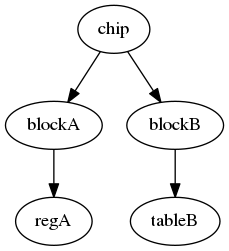

# Overview
This document provides a 10K view of the class hierarchy.

## Usage Model

## Basic Class Hierarchy
The simplified class hierarchy is shown below


The template class "srm_reg" and "srm_reg_array" represent a single entry register or an array of registers (also referred to as a "table"). Each of these classes derive from the base class "srm_component".

The class "srm_array_entry" represents the entry in the register. It uses the *prototype* design pattern to enable access to the array.

The template class "srm_field" represents the base class for all the fields in the register. 

## Access API
## Register Access API
A register can be accessed using the following basic api. 

|Name     |   Model        |     Design    |     Comments    |
----------|----------------|---------------|-----------------|
| read      | Updates. **Checks** non volatile fields against design. | Reads | Task to read from design and match non volatile fields in model. |
| write     | Updates | Updates | Task to write the value to the design and model. |
| get       | Reads | No access | Function to read the value from model. |
| set       | Updates | No access | Function to write the model to model only. |

For example say we have a 32 bit read, write register *myblock.reg32* with 32 bit non volatile field. 
```
   myblock.reg32.write(handle, 32'hdeadbeef); // Writes to both the design and model.

   myblock.reg32.read(handle, read_data); // Reads from design and checks the model.

   // Change the model data but not the design.
   assert(myblock.reg32.get(), 32'hdeadbeef);
   myblock.reg32.set(32'hf00dcafe);
   assert(myblock.reg32.get(), 32'hf00dcafe);
  
  // Check the model data and the design. 
  // FAILS: Design has original data 32'hdeadbeef, Model has 32'hf00dcafe
   myblock.reg32.read(handle, read_data);  // FAILS !!!

```

## Field Access API
Field level api is also provided with similar semantics. Say our reg32 has a bit field *status* at some bit position.

```
   myblock.reg32.status.write(handle, 1'b1); // Writes to both the design and model.

   myblock.reg32.status.read(handle, status); // Reads from design and checks the model.

   // Change the model data but not the design.
   assert(myblock.reg32.status.get(), 1'b1);
   myblock.reg32.status.set(1'b0);
   assert(myblock.reg32.status.get(), 'b0);
  
  // Check the model data and the design. 
  // FAILS: Design has original data 32'hdeadbeef, Model has 32'hf00dcafe
   myblock.reg32.read(handle, read_data);  // FAILS !!!

```

## Array Access API
The array uses the method "entry_at" to access a location in the array. The class *srm_array_entry* is derived from *srm_reg* and so supports the same access api listed above. 

A sample code is below. Say we have a register model with array *myblock.table* of size 32 entries.
```
  // Write to entry 10 in the table.
  myblock.table.entry_at(10).write(handle, 32'hdeadbeef);

  // Read and verify the entry in the model.
  myblock.table.entry_at(10).read(handle, read_data);
   
  myblock.table.entry_at(10).status.write(handle, 1'b1); // Set status bit in location 10.
  myblock.table.entry_at(10).status.read(handle, status_value); // Set status bit in location 10.
  assert(status_value == 1);

```

## Composite Access API
Calling the methods below at a non leaf node in the register hierarchy will cause it to be applied at all the leaf nodes.

|Name     |   Model        |     Design    |     Comments    |
----------|----------------|---------------|-----------------|
| load    | Updates. **NoChecks**. | Reads | Task to read all the leaf nodes in the register hierarchy.
| store     | Updates | Updates | Task to write all the leaf nodes in the model to the design. |
| store_update  | Updates | Updates | stores all the value from the component to the design if the values differ from the current instance value . |

A sample code is below. Say we have a register model like below.





```
  // Load all the design values into the model.
  // Issue reads to regA, tableB and load the data into the regmodel.
  chip.load(handle);   // Design -> regmodel

  // Issue writes to regA, tableB with data from the regmodel.
  chip.store(handle);  // regmodel -> Design

  // Say there is another regmodel *cfg_regmodel* which has the configured values.
  // We would like to write all the values that are different in this new register model. 
  chip.store_update(handle, cfg_regmodel); 
   
```


