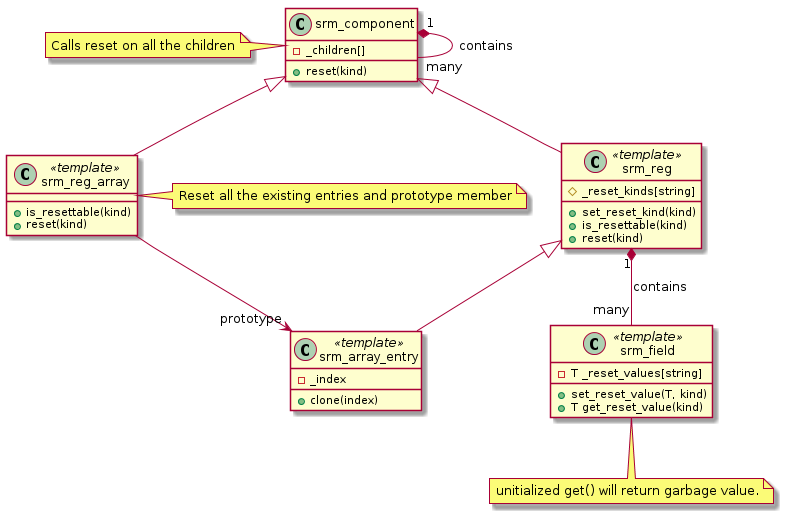

# Introduction
The register model supports multiple types of reset identified by a unique name. If a register or register array is resettable then all the fields are resettable and the user needs to specify the value of each field under different resets.

If the method **reset(kind)** is applied to any non leaf node then it calls it on all the childrent.

If the method **reset(kind)** is applied to a register leaf node then it calls it on all the fields of the register.

If the method **reset(kind)** is applied to a register array, then it is applied to all the existing entries and the prototype entry.

